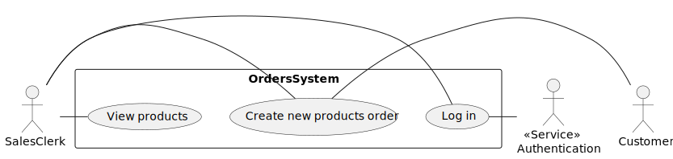
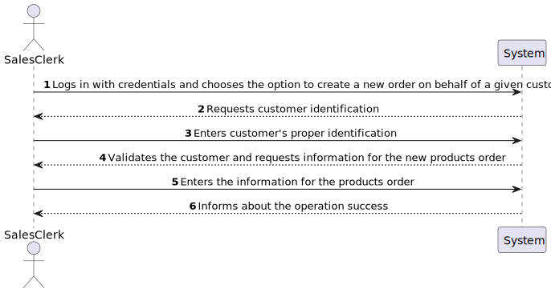
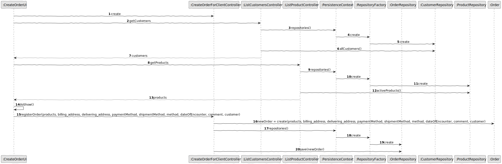
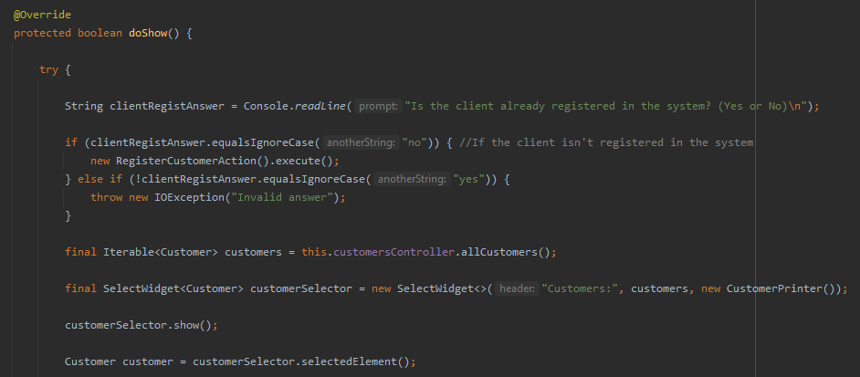
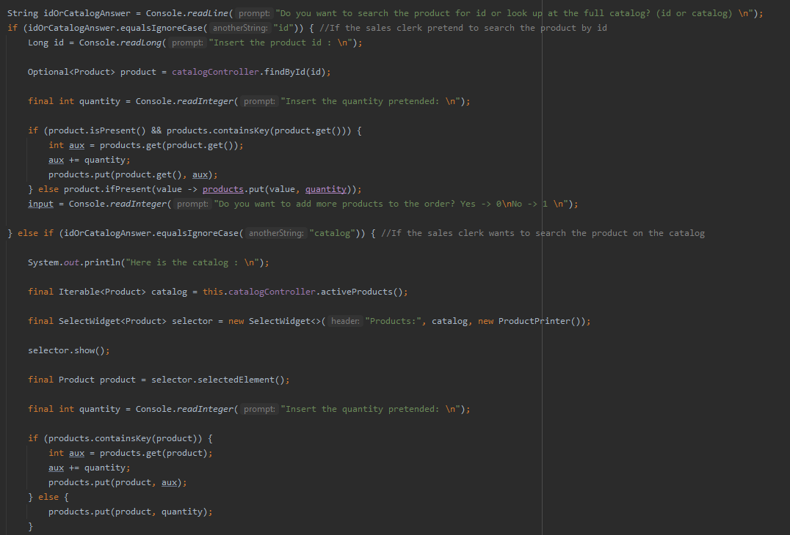
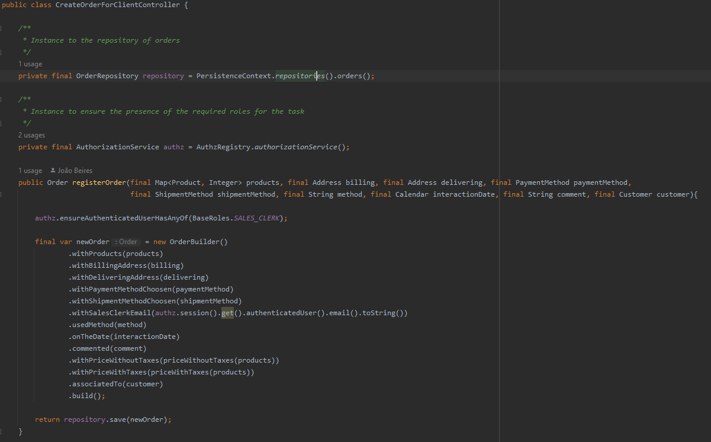
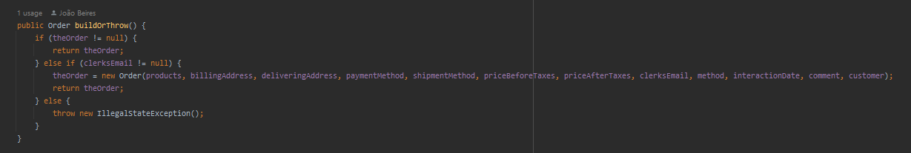
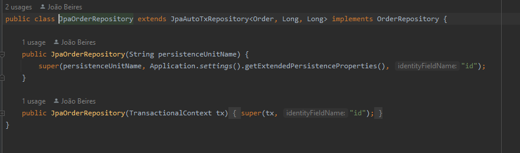
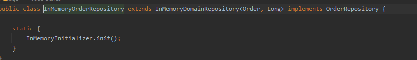

# US1004
=======================================

# 1. Requirements

* As Sales Clerk, I want to create a **new products order** on behalf of a given customer.

# 2. Analysis

## 2.1. Use Case Diagram

## 2.2. Sequence System Diagram

# 3. Design

## **Domain classes:**  

* Order, Customer, Address, Product, Cash, OrderStatus, PaymentMethod, ShipmentMethod 

* **Order** it's an aggregate related to Customer
  - bidirectional relation many-to-one
  - cascade ALL (Orders from a Customer should be removed in case of customers delete)
  - fetch LAZY (only loads needed orders) 
* **Address** is independent of Order
  - unidirectional relation many-to-one 
* **OrderStatus** represents an ENUM with possible status
  - One-to-one unidirectional relationship 
* **PaymentMethod** represents the type of payment choosen
  - One-to-one unidirectional relationship 
* **ShipmentMethod** represents the type of shipment choosen
  - One-to-one unidirectional relationship 

## **Controller:**
 CreateOrderForClientController, ListProductController, ListCustomersController

## **Repository:** 
 OrderRepository

## 3.1. Realização da Funcionalidade

- From a point of view of the user of the app and the system.
  This system sequence diagram explains how it is the interaction between them.
- The first parameters asked by the system are the most important to configure them.
- If there is some invalid input it's thrown an exception, and it's already treated
  with a catch to show a message why the input can't be accepted in the database.

## 3.2. Class Diagram

## 3.3. Applied Standards

- All the information that the user inserts passes through a controller which creates a wall between the UI and backend.
  that is done in the builder to reuse the library class.
- All the classes are done like the project E-Cafetaria lectured in EAPLI classes.
  By this JPA repositories and InMemory.
- The JPA annotations were done correctly in the Order class.
- Always trying to extend/implement classes/interfaces already provided by the framework.

## 3.4. Tests

**Teste 1:** Verificar que não é possível criar uma instância da classe Exemplo com valores nulos.

	@Test(expected = IllegalArgumentException.class)
		public void ensureNullIsNotAllowed() {
		Exemplo instance = new Exemplo(null, null);
	}

# 4. Implementation

## 4.1 User Interface

First the system asks the sales clerk if the customer which order will be created is already registered on the application. If the customer is created, the system presents the list of customers where the sales clerk needs to choose one. If the customer isn't registered, the apllication redirects the sales clerk to the ui where registration is made.

Then, the system provides 2 options to the salesclerk. He chooses between watching the full catalog or searching for a specific id from a product. 

After the console reading all the necessary inputs, the system calls the method from the controller where the order is registered on the system.

## 4.2 Controller

On the controller, only two instances are created. One to ensure that the user has the needed roles to create a new order and another to access the repository from orders. 
Then, a builder is used to build the order object.

## 4.3 Builder

As we can see on the image bellow, the builder calls several sub-methods.

## 4.4 Persistence

Extends AutoTxRepository where transactions are automatically managed. The type of pk is Long

Also, an in memory option is provided

## 4.5 Important Commit

On this commit, the system started being able to associate customers to orders giving more sense to the application.

This commit was also very important because the apllication was, for the first time, able to persist an Order object to the database.

# 5. Integration/Demonstration

On this US, I needed to associate my functionality with the US of registering a customer and also with the US of listing the catalog. This was made by associating the UIs.  

# 6. Observations
