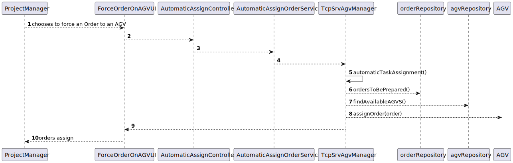
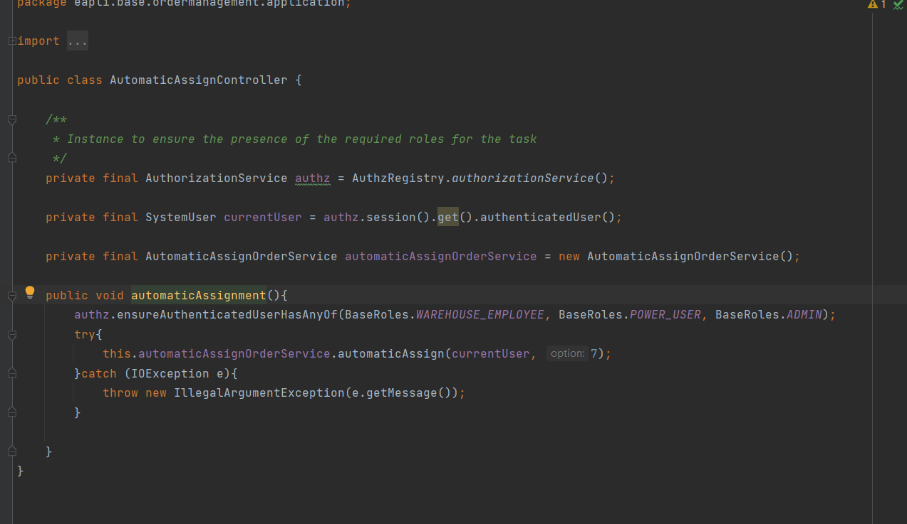
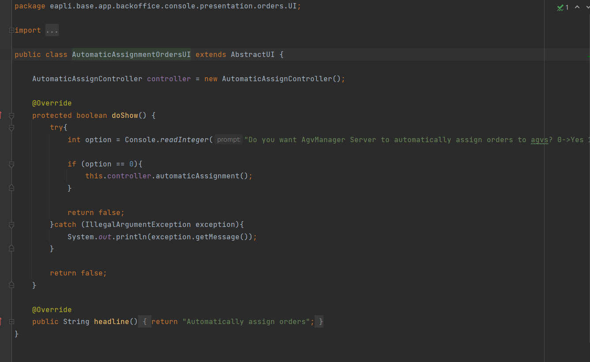
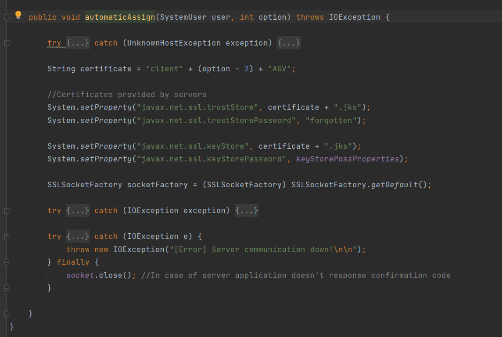
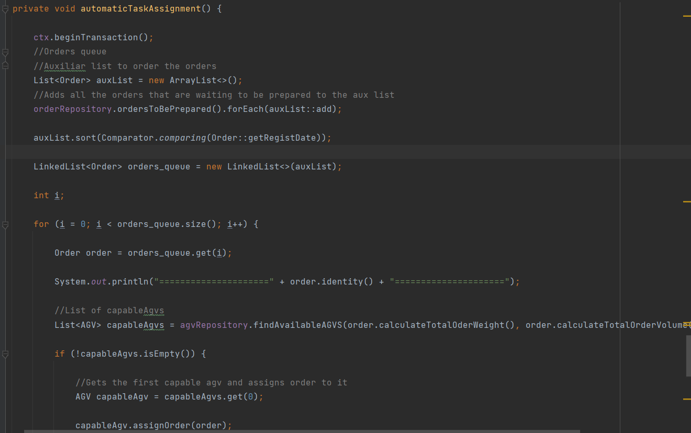
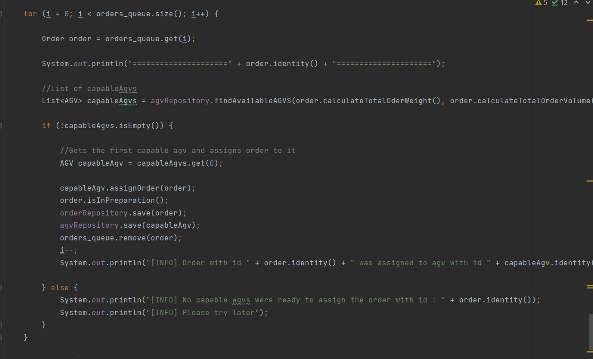

# US4002
=======================================

# 1. Requirements

*As Project Manager, I want that the "AGVManager" component is enhanced with a basic FIFO algorithm to automatically assign tasks to AGVs.*

**4002** As Project Manager I want to:

- 4002.1. A basic FIFO algorithm to automatically assign tasks to AGVs.

# 2. Analysis

## 2.1 Functionality

There is an option in the Warehouse Employee menu where he can choose to start the operation of automatically assign tasks to AGVs.
This menu only can be accessed to Warehouse Employees.

## 2.1 Business Requirements
It must be used the provided application protocol (SPOMS2022).
The "AGVManager" component needs to be enhanced with this feature.

## 2.3 Solving Requirements

- Firstly the orders where ordered by date.
- Then, a queue was made with the ordered list.
- Finally  the system goes to the queue to assign the tasks to the AGV's.

# 3. Design

## 3.1 Realization of Functionality

# 4. Implementation

#Controller

#UI in the warehouse employee menu

#Service

#AVG Manager

