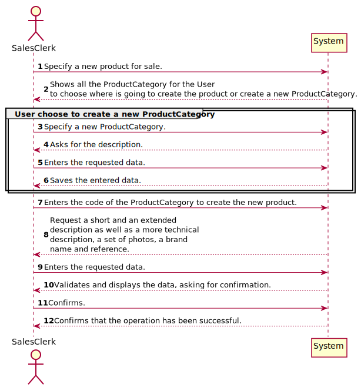
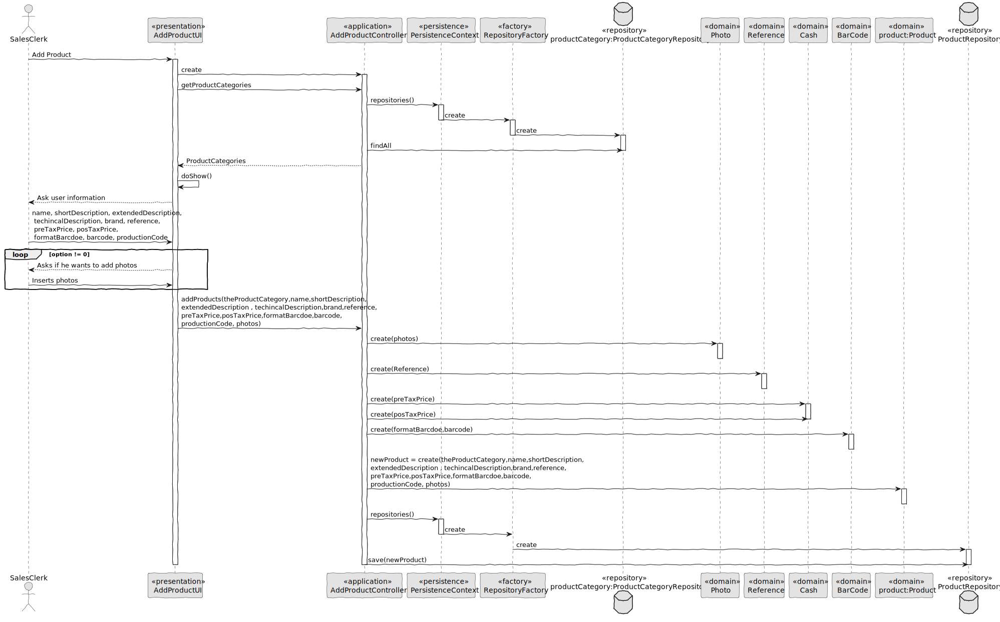
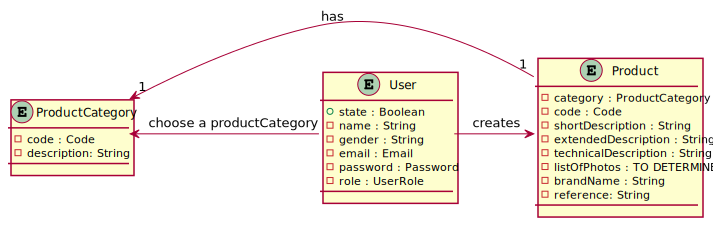

# US1001
=======================================

# 1. Requirements

*In this US we will make it possible to put a new product on sale.*

**1001** As Sales Clerk i want to:

- 1001.1. Choose a product to put on sale.

My interpretation of this US is that I have to put a product on sale. For this I will have to ask the information to the
Sales Clerk to create the new product.

# 2. Análise

In this US we have:

* Product
* ProductCategory
* User

# 3. Design

The User with the SalesClerk role is going to LogIn and choose the "Create New Product for sale" functionality. Then, 
he will choose the ProductCategory. If the user wants he can create a new ProductCategory. For that he only writes the 
new ProductCategory's description because the code will be automatically generated. After the ProductCategory is 
choosen, the SalesClerk will write the information about the new product. The system will validate the information and
the operation is successfully done.

## 3.1. Realization of Functionality

## 3.2. Class Diagram

## 3.3. Padrões Aplicados

*Nesta secção deve apresentar e explicar quais e como foram os padrões de design aplicados e as melhores práticas.*

## 3.4. Testes 
*Nesta secção deve sistematizar como os testes foram concebidos para permitir uma correta aferição da satisfação dos requisitos.*

**Teste 1:** Verificar que não é possível criar uma instância da classe Exemplo com valores nulos.

	@Test(expected = IllegalArgumentException.class)
		public void ensureNullIsNotAllowed() {
		Exemplo instance = new Exemplo(null, null);
	}

# 4. Implementação

*Nesta secção a equipa deve providenciar, se necessário, algumas evidências de que a implementação está em conformidade com o design efetuado. Para além disso, deve mencionar/descrever a existência de outros ficheiros (e.g. de configuração) relevantes e destacar commits relevantes;*

*Recomenda-se que organize este conteúdo por subsecções.*

# 5. Integração/Demonstração

*Nesta secção a equipa deve descrever os esforços realizados no sentido de integrar a funcionalidade desenvolvida com as restantes funcionalidades do sistema.*

# 6. Observações

*Nesta secção sugere-se que a equipa apresente uma perspetiva critica sobre o trabalho desenvolvido apontando, por exemplo, outras alternativas e ou trabalhos futuros relacionados.*

