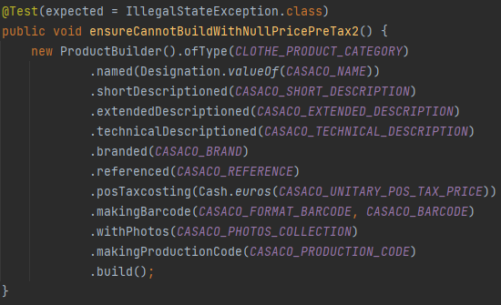
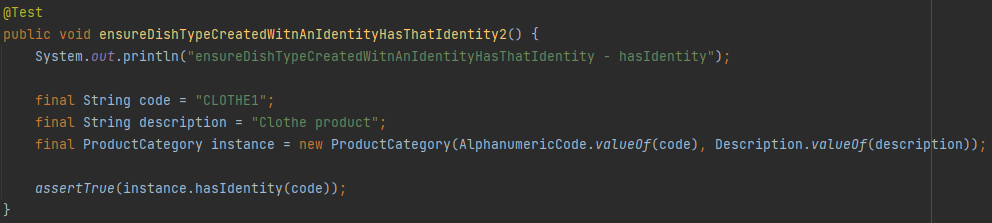

# US1001
=======================================

# 1. Requirements

*In this US we will make it possible to put a new product on sale.*

**1001** As Sales Clerk i want to:

- 1001.1. Choose a product to put on sale.

My interpretation of this US is that I have to put a product on sale. For this I will have to ask the information to the
Sales Clerk to create the new product.

# 2. Analysis

In this US we have:

* AddProductController
* Product
* ProductCategory
* AlphanumericCode
* BarCode
* Cash
* Photo
* ProductBuilder
* Reference
* ProductCategoryRepository
* ProductRepository
* User
* AddProductUI
* AddProductAction
* ProductPrinter
* ProductCategoryPrinter

# 3. Design

The User with the SalesClerk role is going to LogIn and choose the "Create New Product for sale" functionality. Then, 
he will choose the ProductCategory. If the user wants he can create a new ProductCategory. For that he only writes the 
new ProductCategory's description because the code will be automatically generated. After the ProductCategory is 
choosen, the SalesClerk will write the information about the new product. The system will validate the information and
the operation is successfully done.

## 3.1. Realization of Functionality

## 3.2. Class Diagram

* Using the application standard base structure based on layers

Domain classes:
* AddProductController
* Product
* ProductCategory
* AlphanumericCode
* BarCode
* Cash
* Photo
* ProductBuilder
* Reference

Controller: 
* AddProductController

Repository: 
* ProductRepository
* ProductCategoryRepository

## 3.3. Applied standards

- All the information that the user inserts passes through a controller which creates a wall between the UI and backend.
  that is done in the builder to reuse the library class.
- All the classes are done like the project E-Cafetaria lectured in EAPLI classes.
  By this JPA repositories and InMemory.
- The JPA annotations were done correctly in the Product class.
- Always trying to extend/implement classes/interfaces already provided by the framework.

## 3.4. Tests

All tests methods names are easy to understand their purpose.

**ProductBuilderTest**

Build method to build the product instance:

* Test - 1 :

* Test - 2 :

* Test - 3 :

* Test - 4 :

* Test - 5 :

* Test - 6 :

* Test - 7 :

* Test - 8 :

* Test - 9 :

* Test - 10 

* Test - 11 :

* Test - 12 :

* Test - 13 :

* Test - 14 :

**ProductCategoryTest**

* Test - 1 :

* Test - 2 :

* Test - 3 :

* Test - 4 :

* Test - 5 :

* Test - 6 :

**ProductTest**

Build method to build the product instance:

* Test - 1 :

* Test - 2 :

* Test - 3 :

* Test - 4 :

* Test - 5 :

* Test - 6 :

* Test - 7 :

* Test - 8 :

* Test - 9 :

* Test - 10

* Test - 11 :

# 4. Implementation

##4.1 User Interface

This part is to enter all the needed information.

This part is for the selection of the photos.

After this two parts it will be added to the data base.

##4.2 Controller

To make the controller we have the method addProduct using the ProductBuilder.

To add the photo to the Set.

##4.3 Builder

The method buildorthrow check if the attributes are null and if not creates the product instance.

##4.4 Perstistence

The classes Product and ProductCategory are added to the perstistence method to be able to save it in the database.

##4.5 Important commits

In this commit the US started to work, we could add the product but without the barcode, production code and photos.

At this commit the US is finished and I'm going to finish the documentation.

# 5. Integration/Demonstration

We had to create the "Cash" class because the Money class had a bug about the double amounts in the sql tables.

No more problemas and special efforts were necessary.

# 6. Observations

We tried to add the adding ProductCategory US but, because of the time left, we couldn't do it. But knowing that was not
a mandatory US there is no problem. All the US is done but is not adding to the database.

Final Observation: 100% US complete.

