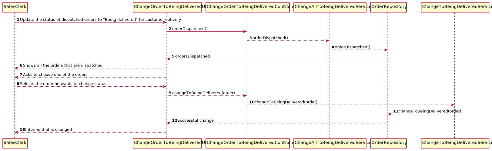

# US1006
=======================================

# 1. Requirements

*As Sales Clerk, I want to access a list of orders that had been dispatched for customer delivery and be able to update some of those orders to as being delivered.*

**1006** As Warehouse Employee I want to:

 - 1006.1. access a list of orders that had been dispatched for customer delivery and be able to update some of those orders to as being delivered.
 
# 2. Analysis

## 2.1 Functionality

In this US we thought about to create an option on the menu of Sales Clerk,
so we can change the dispatched order to a delivered order.
This menu only can be accessed to Sales Clerk.
It will show the lists of orders that had been dispatched.
The warehouse employee needs to insert the order he wants to update the status to delivering.
Gives the opportunity to pass automatically all the orders to "delivering" or a single order.

## 2.2 Business Requirements
As the client asked for:
 - the Sales Clerk can choose which Order he wants to force.
 - Show the following information: order id; date; customer.
 - Only shows the orders that are dispatched

## 2.3 Solving Requirements

1. To resolve this it was created a UI so the Warehouse Employee could Interact with the App.
2. For each Select in the Database it was created a service, so it could be used in different US's.
3. This Selects represent the business rules. Only the dispatched orders are shown.
4. If the sales clerk wants to change all to being delivered we can do that.
5. The Sales Clerk can make all orders that are dispatched to being delivered automatically.
6. The Sales Clerk can individually send a order that is dispatched to being delivered.
7. Everything passed through a controller then a service and for that goes to the repository and finally the database.
8. These actions facilitated the construction of the code.
9. We used the Order class instead of creating a new class named Task. Because it will take time and the class Order only
   has more specifications.

# 3. Design

- From a point of view of the user of the app and the system. 
This system sequence diagram explains how it is the interaction between them.
- All the data passes through classes in a secure way. To protect integrity data in the database
- Everything was implemented as was taught on the classes in ISEP.

## 3.1 Realization of Functionality

## 3.2 Class Diagram

## 3.3 Applied Standards

- All the information that the user inserts passes through a controller which creates a wall between the UI and backend.
- Giving to the user the liberty to choose what he wants to do to optimize his work time.
- Utilizing classes that were already created.
- All the classes are done like the project E-Cafetaria lectured in EAPLI classes.
  By this JPA repositories and InMemory.
- The JPA annotations were done correctly in the AGV class.
- All the code was done to be easily configured and altered if the needs changes.
- Always trying to extend/implement classes/interfaces already provided by the framework.

## 3.4 Testing

### Testing Services

**Test 1:** Test if it selects only the dispatched orders

# 4. Implementation

## 4.1 User Interface

## 4.2 Controller 

## 4.3 Selects

### Class : JpaOrderFactory

## 4.4 ChangeAllToBeingDeliveredService

## 4.5 ChangeToBeingDeliveredService

## 4.6 Important Commit

# 5. Integration/Demonstration

## Sales Clerk Menu

## User Interface

## Result

## DataBase Result

Because the table is too long we only showed the only status that is changed to "BEING_DELIVERED"

# 6. Comments
## Future improvements
- Possible improvements to restring the information that is shown of the orders
