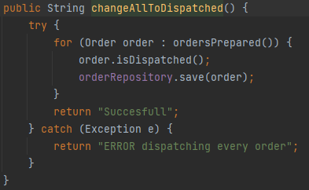

# US2004
=======================================

# 1. Requirements

*In this US we will make it possible to change the status of an order or more.*

**1001** As WarehouseEmployee i want to:

- 1001.1. Choose a order to change the status to having been dispatched for customer delivery.

My interpretation of this US is that I have to change the status of an order. For this I will have to ask the information
about the orders that have status prepared and change it.

# 2. Analysis

In this US we have:

* Order
* ChangeOrderToDispatchedController
* OrderRepository
* ChangeOrderToDispatchedUI
* ChangeOrderToDispatchedAction
* OrderPrinter

# 3. Design

The Warehouse Employee login the app and choose the functionality that says to change the status of an order to 
dispatched. After that will be presented all the orders with the status "Prepared" (status before dispatched). 
The warehouse employee can choose one order only or choose to change all orders presented to dispatched.
If he selects all then the system will do and present a succesfull message. If he selects only one the system will ask 
him for orders until he says to stop. The system always validate if the actions are being successfully done.

## 3.1. Realization of Functionality

## 3.2. Class Diagram

* Using the application standard base structure based on layers

Domain classes:
* Order
* OrderStatus
* PaymentMethod
* ShipmentMethod

Controller: 
* ChangeOrderToDispatchedController

Repository: 
* OrderRepository

## 3.3. Applied standards

- All the information that the user inserts passes through a controller which creates a wall between the UI and backend.
  that is done in the builder to reuse the library class.
- All the classes are done like the project E-Cafetaria lectured in EAPLI classes.
  By this JPA repositories and InMemory.
- The JPA annotations were done correctly in the Order class.
- Always trying to extend/implement classes/interfaces already provided by the framework.

## 3.4. Tests

All tests methods names are easy to understand their purpose.

**ProductBuilderTest**

# 4. Implementation

##4.1 User Interface

This part is to enter all the needed information.

This part is if the user selects to change all the orders.

This part is if the user selects to change one order.

##4.2 Controller

To make the controller we have both method that allows to change the status of one or more status.

##4.4 Perstistence

The classes Order is added to the perstistence method to be able to save it in the database.

##4.5 Important commits

In this commit the US started to work on the US. This was the start of the documentation part.

At this commit the US is finished and I'm going to finish the documentation.

# 5. Integration/Demonstration

For make the things go easier, we had to create orders already with the status "prepared" so we can run the app 
and test this functionlity without having to create orders and make them pass through all the status.

To create the order we created a customer too and to create the customer we created an Address, a Payment method and a 
ShipmentMethod.

No more problemas and special efforts were necessary.

# 6. Observations

Maybe it could be done more commits, but the US did not need so much commits. So, with less than 5 commits the code was
done.

Final Observation: 100% US complete.

