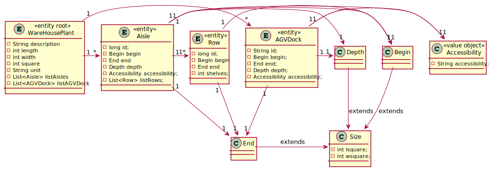

# US2001
=======================================

# 1. Requirements

*In this US it is intended to set up the warehouse plant by uploading a JSON file.*

**2001** As Warehouse Employee I want to:

 - 2001.1. Set up the warehouse plant by uploading a JSON file.

One additional requirements asked by the client was that when running the app
does it automatically, in order to be more time efficient to the warehouse employee.

# 2. Analysis

# 2.1 Functionality

-The client asked for a functionality to import json files that represent the warehouse.
-There isn't persistence on this us, so for that is only created and warehouse object.
-Running the bootstrap the program already imports automatically the file.
-If the warehouse employee needs to import a different file he can do it.
-By choosing the first option of his menu. 
-He needs to insert the path to the new file he wants to import.

# 2.2 Library 
- In this US to conserve time it was implemented an external library to read JSON files.
- The link for the library: https://mvnrepository.com/artifact/com.googlecode.json-simple/json-simple
- JSON-SIMPLE.
- This library as a useful decision for time efficiency.

# 3. Design

- From a point of view of the user of the app and the system.
  This system sequence diagram explains how it is the interaction between them.
- Any exception caused by interaction with the app is catched and treated.

## 3.1 Realization of Functionality

*Nesta secção deve apresentar e descrever o fluxo/sequência que permite realizar a funcionalidade.*

## 3.2 Class Diagram

*Nesta secção deve apresentar e descrever as principais classes envolvidas na realização da funcionalidade.*

## 3.3 Applied Standards

- All possible exceptions made in this US shows a message specifing the exception.
- What went wrong.
- So it doesn't break the app.
- The exception are by specified order

## 3.4 Testing

*Nesta secção deve sistematizar como os testes foram concebidos para permitir uma correta aferição da satisfação dos requisitos.*

**Teste 1:** Verificar que não é possível criar uma instância da classe Exemplo com valores nulos.

	@Test(expected = IllegalArgumentException.class)
		public void ensureNullIsNotAllowed() {
		Exemplo instance = new Exemplo(null, null);
	}

# 4. Implementation

## 4.1 Exceptions

## 4.2 Library

# 5. Integration/Demonstration

- Creating classes on the bootstrap for this us so doesn't mix with other user stories.
- Creating restriction in the accessibility that are accepted by the client.

# 6. Comments

- The code could be structured in smaller methods for sustainability and finding errors.
- A controller could be used. But for simplistic reasons and time it wasn't done.
