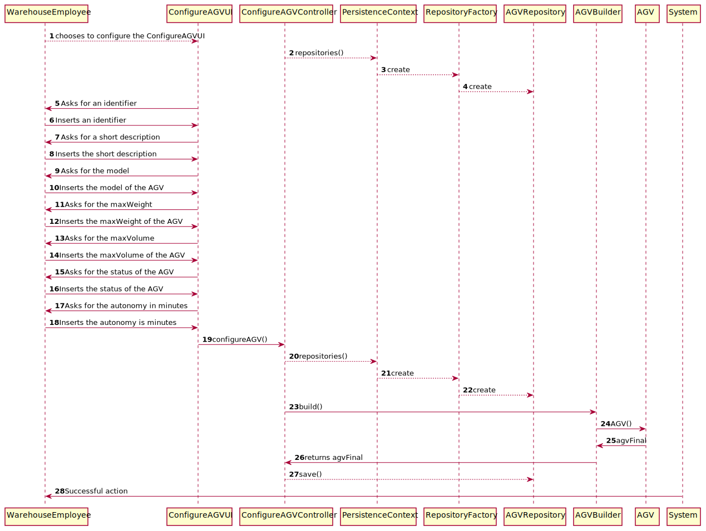

# US2002
=======================================

# 1. Requirements

*As Warehouse Employee, I want to configure the AGVs available on the warehouse.*

**2002** As Warehouse Employee I want to:

 - 2002.1. configure the AGVs available on the warehouse.
 
# 2. Analysis

## 2.1 Functionality

In this US we thought about to create an option on the menu of Warehouse Employee, so he can configure AGVs on the warehouse.
This menu only can be accessed to Warehouse Employees.
It will ask all the information required to configure and AGV on the Warehouse.

## 2.2 Business Requirements
As the client asked for:
 - the identifier is an alphanumeric with 8 chars maximum.
 - the short descriptions cannot be empty and have 30 chars maximum.
 - the model cannot be empty and needs to have 50 chars maximum.
 - the status will describe if it is in a task, charging etc...
 - the position to be equals as the AGV Dock

## 2.3 Solving Requirements

1. To resolve this it was created value objects that could fulfill the client requirements.
2. These value objects contain restrictions to configure an AGV properly.
3. We reused the class from the library "Description" to avoid duplicated code and use coding time to improve other things.
In this case we made the restrictions in the builder with a treated exception.
4. These actions facilitated the construction of the code.
5. Even though in this US it's only thinking about the AGV in a meeting we thought about 
already creating the other related classes like AGVDock, Task so everything is prepared for the other US and 
facilitate future code. 
6. From the previous point it's easier because some code is commented, so it's only to change some little things
if the customer changes his mind. Related to AGV Docks and Tasks. 

# 3. Design

- From a point of view of the user of the app and the system. 
This system sequence diagram explains how it is the interaction between them.
- The first parameters asked by the system are the most important to configure them.
- If there is some invalid input it's thrown an exception, and it's already treated
with a catch to show a message why the input can't be accepted in the database.

## 3.1 Realization of Functionality

## 3.2 Class Diagram

## 3.3 Applied Standards

- All the information that the user inserts passes through a controller which creates a wall between the UI and backend.
- In order to filter the user input and ensure data safety it was used in this US an AGVBuilder.
- Most of the business requirements are done in the AGV class except the parameter Description
that is done in the builder to reuse the library class.
- All the classes are done like the project E-Cafetaria lectured in EAPLI classes.
By this JPA repositories and InMemory.
- The JPA annotations were done correctly in the AGV class.
- All the code was done to be easily configured and altered if the needs changes. To support AGVDock and Task.
- Always trying to extend/implement classes/interfaces already provided by the framework.

## 3.4 Testing

*Nesta secção deve sistematizar como os testes foram concebidos para permitir uma correta aferição da satisfação dos requisitos.*

**Teste 1:** Verificar que não é possível criar uma instância da classe Exemplo com valores nulos.

	@Test(expected = IllegalArgumentException.class)
		public void ensureNullIsNotAllowed() {
		Exemplo instance = new Exemplo(null, null);
	}

# 4. Implementation

## 4.1 User Interface

## 4.2 Controller 

## 4.3 Builder

## 4.4 Persistence

### Class : JpaRepositoryFactory

### Class : JpaAGVRepository

### Class : AGVRepository

### Class : InMemoryAGVRepository

## 4.5 Important Commit

# 5. Integration/Demonstration

- The classed related to this US eventhough they are not needed on this US are already done. 
They are ready to be implemented in the AGV class. The classes are created and some code already done but commented.
- All of this was done thinking about the relationships between classes.

## User Interface

## Database result

# 6. Comments

## Future improvements
- Thinking about creating a query to add an available AGVDock.
- The position being automatically added when setting the AGVDock. 
- The status being a ENUM. Those status being defined by the client. 
