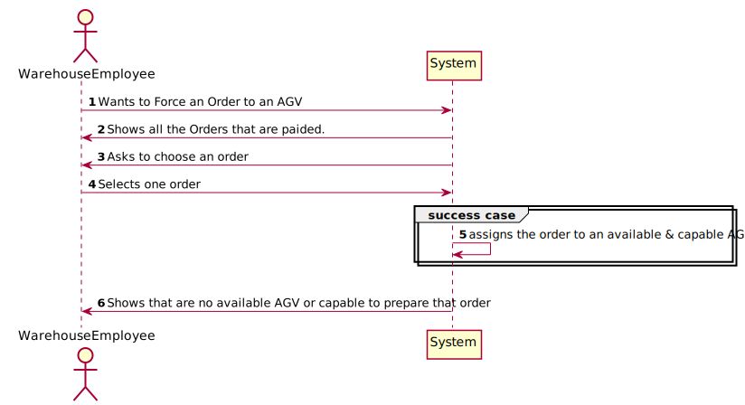
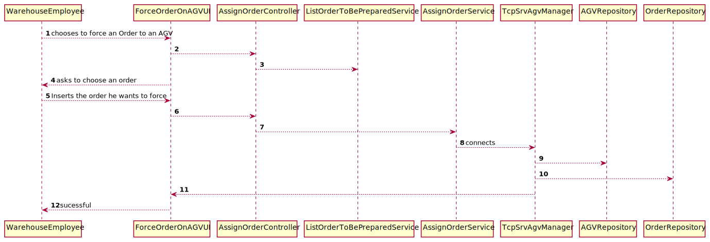
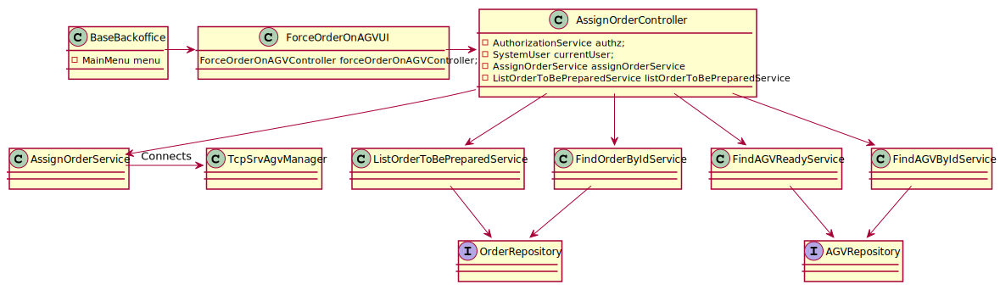
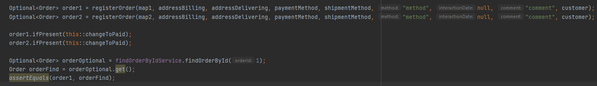

# US2002
=======================================

# 1. Requirements

*As Warehouse Employee, I want to force an Order to an AGV.*

**2003** As Warehouse Employee I want to:

 - 2003.1. Force an Order to an AGV.
 
# 2. Analysis

## 2.1 Functionality

In this US we thought about to create an option on the menu of Warehouse Employee,
so he can force an Order to an AGV .
This menu only can be accessed to Warehouse Employees.
It will show the Paid Orders first.
The warehouse employee needs to insert the PK(order identifier to choose the order he want to force). 

## 2.2 Business Requirements
As the client asked for:
 - the Warehouse Employee can choose which Order he wants to force.
 - the action of choosing an AGV to the order should be automatic.
 - the AGV Manager is responsible for that action.

## 2.3 Solving Requirements

1. To resolve this it was created a UI so the Warehouse Employee could Interact with the App.
2. For each Select in the Database it was created a service, so it could be used in different US's.
3. This Selects represent the business rules. Only the paid orders are shown. Only AGV that are ready
and capable to carry in weight and volume that order
4. If there isn't any AGV with those specifications the UI shows a message to alert the Warehouse Employee.
5. Everything passed through a controller then a service and for that goes to the repository and finally the database.
6. These actions facilitated the construction of the code.
7. We used the Order class instead of creating a new class named Task. Because it will take time and the class Order only
has more specifications.
8. It was redefined the status on the AGV to an ENUM. It has is AGV Dock in transient and on the database it's id.
9. The AGVDock is unique on the AGV

# 3. Design

- From a point of view of the user of the app and the system. 
This system sequence diagram explains how it is the interaction between them.
- All the data passes through classes in a secure way. To protect integrity data in the database
- Everything was implemented as was taught on the classes in ISEP.

## 3.1 Realization of Functionality

## 3.2 Class Diagram

## 3.3 Applied Standards

- All the information that the user inserts passes through a controller which creates a wall between the UI and backend.
- In order to filter the user input and ensure data safety it was used in this US an AGVBuilder.
- Most of the business requirements are done in the AGV class except the parameter Description
that is done in the builder to reuse the library class.
- All the classes are done like the project E-Cafetaria lectured in EAPLI classes.
By this JPA repositories and InMemory.
- The JPA annotations were done correctly in the AGV class.
- RCOMP Standards followed.
- All the code was done to be easily configured and altered if the needs changes. To support AGVDock and Task.
- Always trying to extend/implement classes/interfaces already provided by the framework.

## 3.4 Testing

### Testing Services

**Test 1:** Testing if he finds the right Order 

**Test 2:** Testing if he finds the Orders that are Paid

**Test 3:** Testing if he finds the right AGV

**Test 4:** Testing if the service returns null if doesn't find anything

**Test 5:** Testing if the service finds only with the weight right

**Test 6:** Testing if the service finds only with the volume right

**Test 7:** Testing if only shows the AGVs with Status ready

# 4. Implementation

## 4.1 User Interface

## 4.2 Controller 

## 4.3 Selects

### Class : JpaOrderFactory

### Class : JpaAGVRepository

## 4.4 AssignOrder Service

## 4.6 Important Commit

# 5. Integration/Demonstration

## User Interface

## Server Message

## DataBase Result

# 6. Comments

## Future improvements
-  Knowing earlier that we would need RCOMP would make much faster the development
