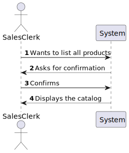
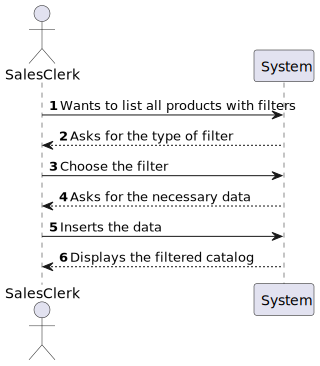
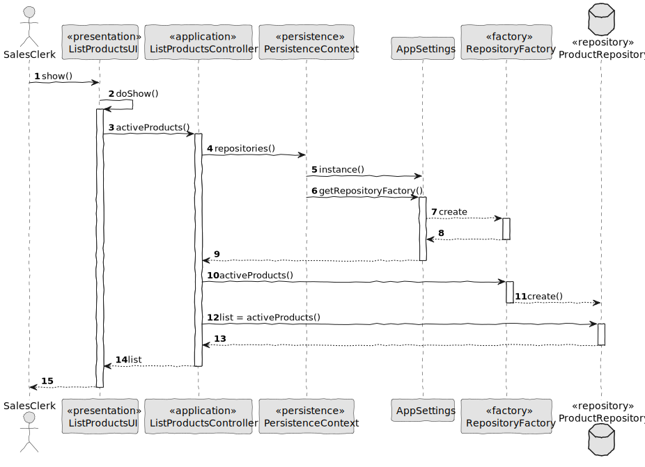

# US1002
=======================================

# 1. Requirements

*In this US we want to give the opportunity to the Sales Clerk to view/search the product catalog.
It is given the option  to filter the catalog by three ways: Category, Brand and Short description.*

**1002** As Sales Clerk I want to:

- 1003.1. View/Search the product catalog.

# 2. Analysis

For this US it is needed view/search the product catalog, so we tried to use as an example the US in the eCafeteria where it was needed lists the dish and dish types.

In this US we can see that:

* "sales clerk menu" uses the backoffice application to view and filter the product catalog.

Client requests :
* Filter the catalog by:
  * Product category; 
  * Product brand;
  * Product short description;

# 3. Design

Filtered option :

## 3.1 Realization of Functionality

# 4. Integration/Demonstration

It was made an effort to make sure that the clerk would have the possibility to filter the product catalog.

TEST PLAN

	_______________________________
	CASO #1: View/Search Product Catalog
	_______________________________

	1. Log as sales clerk
	2. Choose "List product with filters"
    3. Choose the wanted filter:
        Category, Brand and Short Description
    4. Asks for the needed data
    5. Displays the filtered catalog
    7. Done.
