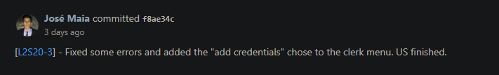

# US1003
=======================================

# 1. Requirements

*In this US we want to give the opportunity to the Sales Clerk to register a new costumer. After the registration of the 
new customer it is asked to the sales clerk if he wants to give system credentials to the customer.*

**1003** As Sales Clerk I want to:

- 1003.1. Register a new Costumer.
- 1003.2. Give the new costumer system credentials.

# 2. Analysis

For this US it is needed to create a new Customer, so we tried to use as an example the US in the eCafeteria where it was needed to create a new user. It was also important 
analysing the US where the dishes where created what also helped a lot.

In this US we can see that : 

* "sales clerk menu" uses the backoffice application to register a new Customer in the repository.
* a customer is characterized by a first and last name, an email, a valid Value-Added Tax (VAT)
  identifier and a phone number. Optionally, he might state his birthday, gender and several addresses.
* the costumer ,as a user ,has additionally a username and a password that is automatically generated by the
  system, and it's added to the user the role SALES_CLERK.

Parameter rules:

* the customer when created has a generated ID, that is unique in the system.
* the email of the user has to be unique in the system.
* birthdate, gender and addresses can not be stated.
* addresses are characterized by street name, door number, zip code, city and country.
* birthdate is characterized by day, month and year.

# 3. Design

## 3.1 Realization of Functionality

## 3.2 Class Diagram

Domain classes :
  Customer

Customer is an independent aggregate
* Name is type "Name" from the framework.
* Email is type "EmailAddress" from the framework.
* Gender,Phone number, vat and address are value objects with classes created by the team.

Controller: RegisterCustomerController
UI : RegisterCustomerUI
Repository : CustomerRepository

## 3.3 Applied standards

- All the information that the user inserts passes through a controller which creates a wall between the UI and backend.
  that is done in the builder to reuse the library class.
- All the classes are done like the project E-Cafetaria lectured in EAPLI classes.
  By this JPA repositories and InMemory.
- The JPA annotations were done correctly in the Product class.
- Always trying to extend/implement classes/interfaces already provided by the framework.

## 3.4 Testing

*Nesta secção deve sistematizar como os testes foram concebidos para permitir uma correta aferição da satisfação dos requisitos.*

**Teste 1:** Verificar que não é possível criar uma instância da classe Exemplo com valores nulos.

	@Test(expected = IllegalArgumentException.class)
		public void ensureNullIsNotAllowed() {
		Exemplo instance = new Exemplo(null, null);
	}

# 4. Implementation

Validation:

In the value object classes the necessary validations are made.

      protected BirthDate(int day, int month, int year) throws IllegalArgumentException{
      Preconditions.ensure(day > 0 && day <= 31, "Day is eligible");
      Preconditions.ensure(month >0 && month <= 12, "Month is eligible");
      this.day = day;
      this.month = month;
      this.year = year;
      }

After the customer is created it is asked if it is wanted to generate credentials for the customer. The password needed to be random so in order
to create a random password the class "rawPassword" was created with the right implementation :

        public static String createPwd(){
        String pwd = "";
        Random random = new Random();
        for(int i = 0; i < 7; i++){
        int n = random.nextInt(ALPHANUMERICALSIZE);
        pwd = pwd + ALPHANUMERICAL.charAt(n);
        }
        return pwd;
        }

# 4.1 Important commits

Here the US was finished already with the "add credentials option" in the menu.

Finished all the documentation and both US's were fully functional.

# 5. Integration/Demonstration

It was made an effort to make sure that the clerk would have the possibility to add credentials to the customer in the end of the registration.
It was integrated every request that the client wanted in the US : validations, email is unique in the system, gender,address and birthdate are optional and finally
the customer is added to the database has a customer and system user.

TEST PLAN

	_______________________________
	CASO #1: Register Customer
	_______________________________

	1. Log as sales clerk
	2. Choose register customer option
    3. Add the requested data where:
        Name, email, phone number and vat is the only obrigatory data.
    4. If all data is valid the customer is created.
    5.Choose if it is wanted to add credentials.
    6. Add an user name to the customer.
    7. Done.
          