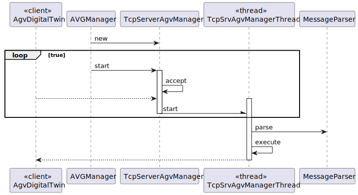
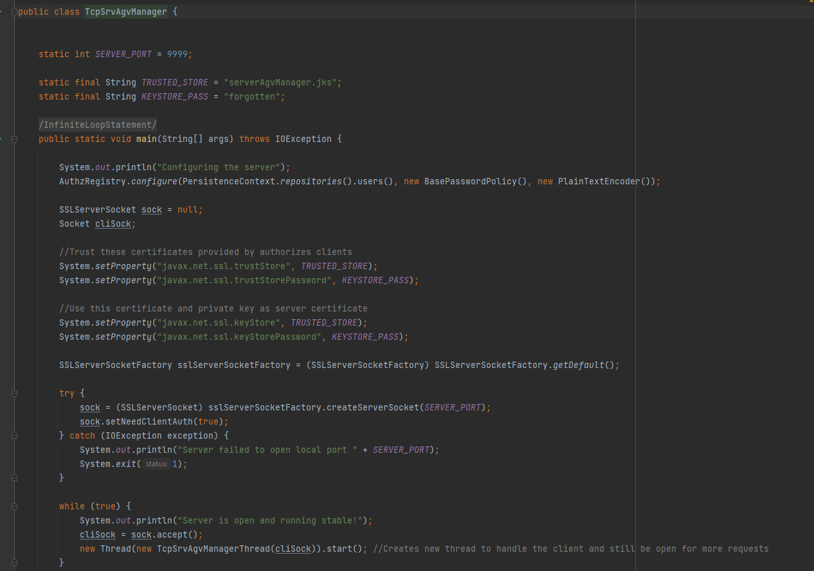
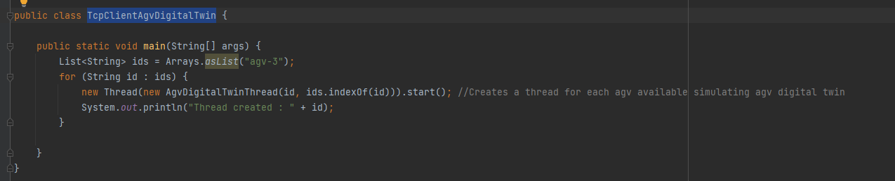
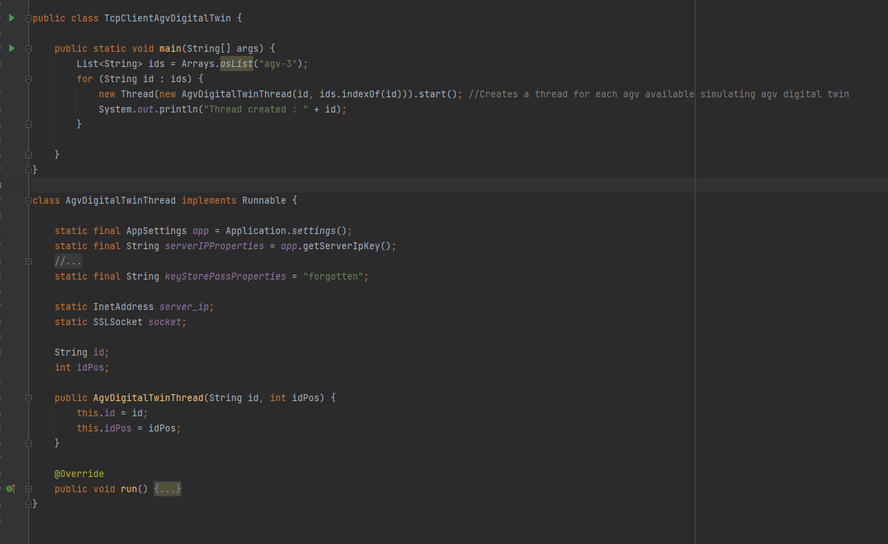
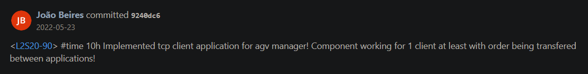

# US4001
=======================================

# 1. Requirements

*As Project Manager, I want that the "AGVManager" component supports properly, at request, the needs of the "BackOfficeApp" application as well as the needs the AGV digital twin.*

**4001** As Warehouse Employee I want to:

- 4001.1. Force an Order to an AGV.

# 2. Analysis

## 2.1 Business Requirements
It must be used the provided application protocol (SPOMS2022).
It is suggested the adopting of concurrent mechanisms (e.g. threads) and state sharing between these mechanisms.

# 3. Design

- From a point of view of the user of the app and the system.
  This system sequence diagram explains how it is the interaction between them.
- All the data passes through classes in a secure way. To protect integrity data in the database
- Everything was implemented as was taught on the classes in ISEP.

## 3.1 Sequence Diagram

## 3.2 Applied Standards

- RCOMP Standards followed.
- All the code was done to be easily configured and altered if the needs changes. To support AGVDock and Task.
- Always trying to extend/implement classes/interfaces already provided by the framework.
- Application protocol (SPOMS2022).

# 4. Implementation

## TcpSrvAgvManager

## TcpClientAgvDigitalTwin

## TcpClientAgvDigitalTwin

## Important commit 

